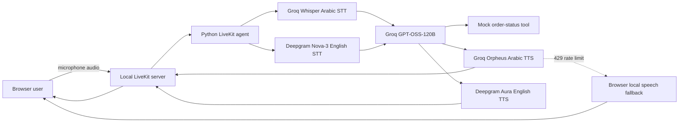

# Arabic and English LiveKit Voice Assistant

A local, browser-based food-delivery voice assistant built with the LiveKit Agents framework. It supports Arabic and English conversations, speech-to-text, an LLM response, text-to-speech, a mocked order-status tool, and a push-to-talk web demo.

The LiveKit server runs locally in Docker. The AI models run through hosted providers, so a local GPU is not required.

---

## 🚀 Quick Start (Run Right Away)

Follow these steps to run the assistant immediately:

### 1. Check/Configure the `.env` file
Ensure the `.env` file in the root folder contains your primary Groq API key:
```env
GROQ_API_KEY=gsk_...
```
*(The file is not included for security)*

### 2. Start the LiveKit Server (Docker)
In a PowerShell terminal, run:
```powershell
docker compose up -d
```

### 3. Start the Python Voice Agent
In a second PowerShell terminal, run:
```powershell
python -m arabic_voice_agent.agent dev
```
Wait until you see: `registered worker ...`

### 4. Start the Web Server
In a third PowerShell terminal, run:
```powershell
python scripts/demo_server.py
```

### 5. Talk to the Agent!
Open **[http://127.0.0.1:8000](http://127.0.0.1:8000)** in your browser:
1. Select **Arabic** or **English**.
2. Click **Authenticate and connect** and allow microphone access.
3. Hold the talk button, say **"ألف واثنين"** (for Arabic order status) or **"Details of 1002"** (for English), then release the button!

---

## Features

- Arabic pipeline: Groq Whisper STT -> Groq GPT-OSS-120B -> Groq Orpheus Arabic Saudi TTS (`abdullah`).
- English pipeline: Deepgram Nova-3 STT -> Groq GPT-OSS-120B -> Deepgram Aura-2 TTS.
- Arabic and English language selector in the browser.
- Push-to-talk interface with end-of-speech handling.
- LiveKit room authentication using short-lived local JWTs.
- Mocked `get_order_status` function tool for the food-delivery assistant.
- Groq API-key failover for STT, LLM, and Arabic TTS.
- Browser speech fallback if Groq Arabic TTS is rate-limited.
- Structured logs for user speech, transcripts, agent state, and provider errors.
- Unit tests for settings, pipeline wiring, and the mocked order service.

## Architecture



## Prerequisites

- Windows, macOS, or Linux.
- Python 3.10 or newer. Python 3.11 is recommended.
- Docker Desktop (or Docker Engine with Docker Compose).
- A Groq account and API key.
- A Deepgram API key if you want to use the English option.
- A browser with microphone permission enabled.

The project has been tested with a local LiveKit Docker server and Python 3.13 on Windows.

## Project layout

```text
section_1/
├── docker-compose.yml              # Local LiveKit server
├── pyproject.toml                  # Python package and dependencies
├── requirements.txt                # Installs this project with development tools
├── .env                            # Local secrets and settings; never commit this
├── README.md
├── scripts/
│   ├── demo_server.py              # Local web server and token endpoint
│   ├── create_local_token.py       # Optional standalone JWT generator
│   └── tool_demo.py                # Mock tool demonstration
├── src/arabic_voice_agent/
│   ├── agent.py                    # LiveKit agent, providers, fallback logic
│   ├── config.py                   # Environment validation
│   ├── prompts.py                  # Arabic and English instructions
│   ├── pipeline.py                 # Standalone audio pipeline
│   ├── providers/                  # Provider abstractions and Groq wrappers
│   └── services/                   # Conversation and order-status services
├── tests/                          # Unit tests
└── web_demo/index.html             # Language selector and push-to-talk UI
```

## 1. Install the Python environment

Open PowerShell in the project folder:

install  the provided requirements file:

```powershell
pip install -r requirements.txt
```

## 2. Configure environment variables

Edit `.env` in the project root. Do not put secrets in source code, screenshots, Git, or chat messages.

```env
# Required for Arabic and for the shared GPT-OSS model
GROQ_API_KEY=your_primary_groq_key

# Optional: automatically used if the primary Groq key is rate-limited
GROQ_API_KEY_FALLBACK=your_second_groq_key

# Required only for the English option
DEEPGRAM_API_KEY=your_deepgram_key

# Local LiveKit development server
LIVEKIT_URL=ws://localhost:7880
LIVEKIT_API_KEY=devkey
LIVEKIT_API_SECRET=secret
AGENT_NAME=food-support

# Models and voice
STT_MODEL=whisper-large-v3-turbo
LLM_MODEL=openai/gpt-oss-120b
TTS_MODEL=canopylabs/orpheus-arabic-saudi
TTS_VOICE=abdullah
```

`GROQ_API_KEY_FALLBACK` is optional. When it is set, the agent first uses `GROQ_API_KEY`, then automatically tries the fallback key after a provider failure such as HTTP 429. This is failover, not a way to bypass account quotas or provider policy.

### Where to get the API keys yo use them :
1. https://console.groq.com/keys 
2. https://deepgram.com/ 


## 3. Start LiveKit in Docker

The included Docker configuration is prepared for a same-computer Windows demo. It advertises `127.0.0.1` rather than Docker's internal `172.x.x.x` address, which prevents common browser peer-connection failures.

Start the server:

```powershell
docker compose up -d
```

Check that it is running:

```powershell
docker compose ps
docker compose logs -f livekit
```

Expected development credentials in the logs:

```text
API Key: devkey
API Secret: secret
```

The Docker Compose file publishes:

| Port | Purpose |
| --- | --- |
| `7880` | LiveKit HTTP and WebSocket signalling |
| `7881` | LiveKit RTC TCP |
| `7882/udp` | LiveKit RTC UDP media |

## 4. Start the voice agent

Open a second PowerShell terminal, activate the same virtual environment, then run:

```powershell
python -m arabic_voice_agent.agent dev
```

Wait until you see:

```text
registered worker ... "agent_name": "food-support"
```

Keep this terminal open. It contains the useful application logs, including final transcripts and any provider errors.

## 5. Start the web demo

Open a third terminal, activate the virtual environment, then run:
 - This opens the web demo to test the full section 1

```powershell
python scripts\demo_server.py
```

Open [http://127.0.0.1:8000](http://127.0.0.1:8000) in your browser.

1. Select **Arabic** or **English**.
2. Click **Authenticate and connect**.
3. Allow microphone access when prompted.
4. Hold the talk button while speaking.
5. Release the button and wait for the assistant.

The demo keeps the microphone open briefly after release so LiveKit's voice activity detector receives enough trailing silence to close the turn reliably.

### Language behavior

| Mode | STT | LLM | TTS | Required keys |
| --- | --- | --- | --- | --- |
| Arabic |  Whisper Large V3 Turbo using Groq |  GPT-OSS-120B using Groq |  Orpheus Arabic Saudi (`abdullah`) | Groq |
| English | Deepgram Nova-3 | Groq GPT-OSS-120B using Groq | Deepgram Aura-2 Thalia | Groq + Deepgram |

The agent's language is passed securely in the LiveKit room dispatch metadata. The browser does not select providers directly.

## How the Arabic TTS fallback works

Groq can return HTTP `429 Too Many Requests` when a key or account reaches a TTS rate limit. The project handles this in layers:

1. It tries the primary Groq key.
2. If `GROQ_API_KEY_FALLBACK` is configured, it tries that key.
```


## Function tool demonstration

The assistant has one safe, mocked tool:

```text
get_order_status(order_id)
```

It looks up a fixed test order and never calls an external delivery system. Try asking in Arabic for the status of an order, then provide a numeric order ID when requested.

Run the standalone tool example:

```powershell
python scripts\tool_demo.py
```

## Tests

Run the test suite:

```powershell
pytest -q
```

Check Python syntax:

```powershell
python -m compileall -q src scripts
```

## Technical write-up

For detailed explanations of barge-in/interruption handling, safety schema design for secondary tools, and vendor decoupling trade-offs, please refer to [NOTES.md](file:///C:/Users/nezar/Downloads/section_1/NOTES.md).

## Production notes

This project is a local technical demonstration. Before production use, replace `devkey` and `secret`, use TLS and TURN for WebRTC, generate tokens from an authenticated backend, store secrets in a secret manager, add provider monitoring and rate-limit policies, and replace the mocked order tool with an authenticated, audited service.
