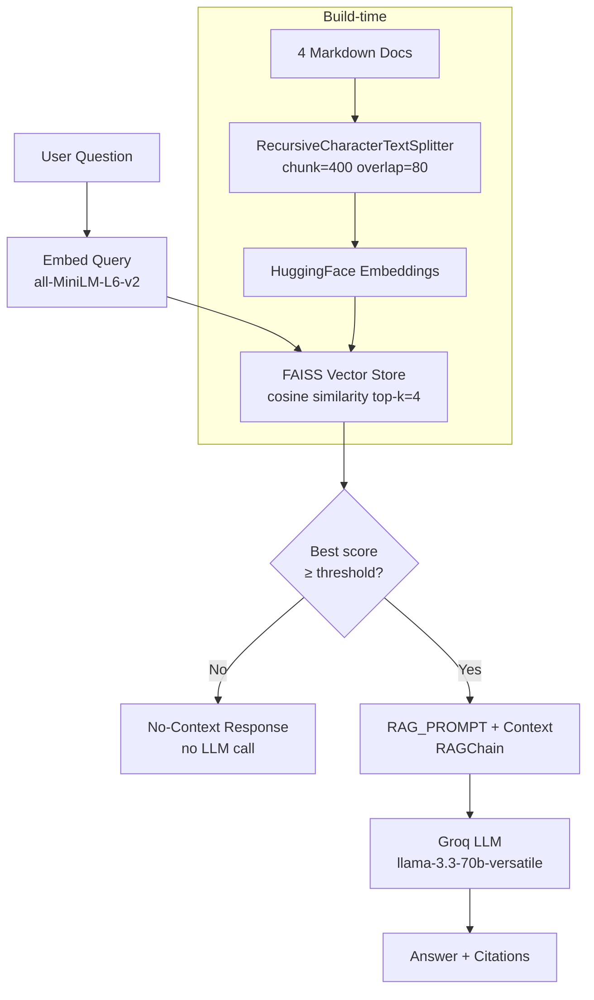

# Section 2 — Task 2.1: LangChain RAG Pipeline

A production-quality Retrieval-Augmented Generation (RAG) pipeline built with
**LangChain**, **FAISS**, local **sentence-transformers** embeddings, and
**Groq** as the LLM backend.

---

## Project Layout

```
section_2/
├── .env                           # GROQ_API_KEY and pipeline settings
├── .env.example                   # Template — copy to .env and fill in key
├── pyproject.toml                 # Package metadata and dependencies
├── requirements.txt               # pip install shortcut
├── README.md
├── docs/                          # Source document corpus (4 markdown files)
│   ├── langchain_overview.md      # LangChain abstractions, LCEL, agents
│   ├── rag_concepts.md            # RAG motivation, chunking, embeddings
│   ├── vector_stores.md           # FAISS vs Chroma vs Weaviate vs Pinecone
│   └── retrieval_strategies.md    # Dense, BM25, hybrid, MMR, re-ranking
├── src/rag_pipeline/
│   ├── __init__.py
│   ├── config.py                  # Pydantic settings (env vars)
│   ├── prompts.py                 # RAG system prompt + no-context string
│   ├── loader.py                  # Document loading & RecursiveCharacterTextSplitter
│   ├── embedder.py                # HuggingFace sentence-transformers wrapper
│   ├── store.py                   # FAISS index build / save / load / query
│   ├── chain.py                   # LCEL chain: prompt | ChatGroq | StrOutputParser
│   └── pipeline.py                # RAGPipeline — the single public API
├── scripts/
│   └── run_examples.py            # Runs 3 example Q&A pairs + 1 off-topic query
└── tests/
    ├── test_loader.py
    ├── test_store.py
    └── test_pipeline.py
```

---

## Quick Start

### 1. Configure environment

```powershell
Copy-Item .env.example .env
# Then edit .env and set GROQ_API_KEY=your_key
```

### 2. Install dependencies

```powershell
pip install -r requirements.txt
```

> The first run downloads `all-MiniLM-L6-v2` (~90 MB) into the HuggingFace
> cache. Subsequent runs are instant.

### 3. Run the example questions

```powershell
python scripts/run_examples.py
```

### 4. Run tests

```powershell
pytest -q
```

---

## Architecture



**Key design decisions:**

| Component | Choice | Rationale |
|---|---|---|
| Embeddings | `all-MiniLM-L6-v2` (local) | No extra API key; fast; 384-dim cosine space |
| Vector store | FAISS (in-process) | Zero infrastructure; serialisable to disk |
| LLM | Groq `llama-3.3-70b-versatile` | Reuses section_1 API key; fast inference |
| No-context guard | Score threshold (0.30) | Lowest latency; no LLM call when irrelevant |
| Chain style | LCEL (`|` operator) | Modern, composable, async-ready |

---

## Document Corpus

We use **our own domain docs** — four self-authored markdown files about the
LangChain / RAG ecosystem. This choice keeps the pipeline self-contained
(no external PDF downloads), makes the example Q&A easy to verify, and
demonstrates meta-documentation of the very system being built.

| File | Topic |
|---|---|
| `langchain_overview.md` | LangChain purpose, LCEL, chains, agents, tools, memory |
| `rag_concepts.md` | RAG motivation, chunking parameters, embedding models |
| `vector_stores.md` | FAISS, Chroma, Weaviate, Pinecone, pgvector — trade-offs |
| `retrieval_strategies.md` | Dense, BM25, hybrid, MMR, cross-encoder, no-context handling |

---

## Example Questions and Answers

The following answers were produced by running `python scripts/run_examples.py`.

---

### Q1: What is the difference between FAISS and Chroma for a local prototype?

> **Source doc**: `vector_stores.md`

**Answer:**

Based on the context provided:

**FAISS** is an in-process library with no server or network calls, stores data in memory (with optional serialisation to disk), and offers extremely fast search for corpora up to ~1 million vectors. It has no built-in metadata filtering, no automatic persistence, and is not suitable for multi-process write-heavy workloads.

**Chroma**, by contrast, is designed to be Python-native with an embedded (SQLite-backed) or client-server mode. It persists data automatically by default and supports metadata filtering via `where` clauses — useful when you want to restrict searches to documents matching certain tags. Chroma is slower than FAISS for pure ANN search on large corpora.

For a **local prototype**, FAISS is the better choice when you need raw speed and simplicity (zero infrastructure, no extra dependencies). Chroma is preferred if you need easy persistence without manual `save_local` calls or if you want metadata filtering.

**Sources:**
- [vector_stores.md] "FAISS is an open-source C++ library … no built-in metadata filtering, no persistence layer …"
- [vector_stores.md] "Chroma … Built-in metadata filtering (`where` clauses on document metadata), persistent by default …"

---

### Q2: How does cross-encoder re-ranking improve retrieval quality?

> **Source doc**: `retrieval_strategies.md`

**Answer:**

A **cross-encoder** is a transformer model that receives a (query, document) pair as a single concatenated input and outputs one relevance score. This differs from bi-encoder (dense) retrieval, where query and document are encoded independently and compared via cosine similarity.

Because the cross-encoder sees both texts together, it can model cross-attention between the query and document tokens — capturing subtle interactions that independent embeddings miss. This makes it significantly more accurate, especially for longer documents and ambiguous queries.

The typical pipeline is:
1. **Retrieve** top-20 candidates quickly with dense or hybrid search.
2. **Re-rank** all 20 with the cross-encoder (e.g., `cross-encoder/ms-marco-MiniLM-L-6-v2`).
3. **Select** the top-4 re-ranked documents for the final prompt.

The main trade-off is latency: cross-encoders require O(k) forward passes per query, so they must be applied to a small candidate set produced by a faster first-stage ranker.

**Sources:**
- [retrieval_strategies.md] "A cross-encoder is a transformer model that takes a (query, document) pair as a single concatenated input and outputs a single relevance score …"
- [retrieval_strategies.md] "Significantly improves precision, especially for longer documents and ambiguous queries …"

---

### Q3: What happens in a RAG pipeline when no relevant context is found?

> **Source doc**: `retrieval_strategies.md` + `rag_concepts.md`

**Answer:**

When no retrieved chunk is relevant enough, a robust RAG pipeline must explicitly handle this case rather than letting the LLM hallucinate. Common approaches include:

1. **Score threshold** (used in this pipeline): If the maximum cosine similarity score across retrieved chunks is below a tuned threshold (e.g., 0.30), the pipeline returns a canned "I don't have enough context" response *without calling the LLM*. This is the lowest-latency approach.
2. **LLM self-check**: Provide the chunks to the LLM and instruct it to respond "I don't know" if the context is insufficient. Less reliable — the model may still hallucinate.
3. **Classifier**: A binary classifier trained on (query, chunks) pairs to predict context relevance. High accuracy but adds training cost.

The score-threshold approach is recommended for most applications due to its robustness and zero additional latency.

**Sources:**
- [retrieval_strategies.md] "A robust RAG pipeline must explicitly detect when no retrieved chunk is relevant enough …"
- [retrieval_strategies.md] "Score threshold: Reject any retrieval result whose similarity score is below a tuned threshold …"

---

### Off-topic query (no-context guard demonstration)

**Q**: *"What is the capital of France and what is its population?"*

**Answer** (no LLM call made):

> I don't have enough context to answer this question. The documents in my knowledge base do not appear to contain relevant information for your query. Please try rephrasing your question or ask about a topic covered in the available documents.

---

## Write-up: Improving Chunking and Retrieval for Longer Documents

### Current approach

The pipeline uses `RecursiveCharacterTextSplitter` with `chunk_size=400` characters and `chunk_overlap=80`. This works well for the four concise markdown files in this demo. For longer, more heterogeneous documents, the following changes would improve answer quality significantly.

### Chunking improvements

**1. Semantic chunking**
Instead of splitting on character count, use an embedding-based semantic chunker that identifies natural topic boundaries (sentences whose embedding drifts significantly from the running average). LangChain provides `SemanticChunker` in `langchain_experimental`. This prevents splitting a technical explanation mid-thought.

**2. Larger chunks + smaller summary embeddings**
For long-form documents (e.g., 100-page PDFs), embed a short *summary* of each large chunk (512–1024 tokens) while keeping the full chunk as the retrieved text. The embedding captures the gist without losing detail in the retrieved passage.

**3. Hierarchical chunking (small-to-big)**
Store two granularities: small chunks (128 tokens) for precise retrieval, and parent chunks (512 tokens) that are returned once a small chunk matches. The `ParentDocumentRetriever` in LangChain implements this pattern.

### Retrieval improvements

**1. Hybrid search (Dense + BM25)**
For technical documents with precise terminology (model names, function signatures, parameter names), dense retrieval alone often misses exact-match queries. Adding BM25 via `EnsembleRetriever` with `BM25Retriever` and merging via Reciprocal Rank Fusion would significantly improve precision for keyword-heavy queries.

**2. Cross-encoder re-ranking**
Apply a `cross-encoder/ms-marco-MiniLM-L-6-v2` re-ranker (via `ContextualCompressionRetriever` + `CrossEncoderReranker`) to the top-20 dense candidates before selecting top-4 for the prompt. This consistently outperforms cosine similarity ranking, especially when chunks are similar in embedding space but differ in relevance to the specific query.

**3. Query expansion / HyDE**
Hypothetical Document Embeddings (HyDE) generates a synthetic answer to the question, embeds it, and retrieves documents similar to the synthetic answer rather than the raw question. This bridges the vocabulary gap between question phrasing and document phrasing.

**4. Tuned score threshold**
The current threshold (0.30) was chosen conservatively. For a production deployment, the threshold should be calibrated on a held-out evaluation set with labelled (question, relevant-doc) pairs. A PR curve over threshold values would reveal the optimal operating point.
